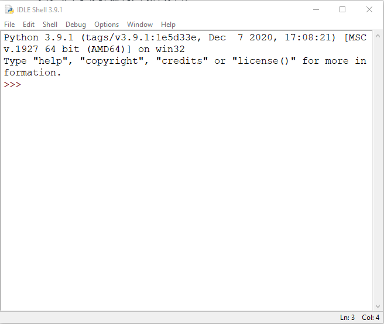

# এনভায়রনমেন্ট সেট আপ

### Interpreter কি? এবং কেন আমাদের প্রয়োজন?

যে কোন প্রোগ্রামিং ভাষা শেখার পূর্বশর্ত ওই ভাষায় কিছু প্রোগ্রাম (কম্পিউটারকে কিছু নির্দেশনা দেয়া) লিখা। আর আমরা যেহেতু কম্পিউটারে প্রোগ্রাম(কোড) লিখবো  আমাদের ভাষায় (এই ক্ষেত্রে ইংরেজিতে) কিন্তু কম্পিউটার তো ইংরেজি ভাষা বুঝে না! কম্পিউটার বুঝে তার নিজস্ব ভাষা মেশিন ল্যাঙ্গুয়েজ বা বাইনারি\* (০,১)। তাহলে আমাদের এমন কিছু দরকার যা আমাদের ভাষাও বুঝে আবার কম্পিউটারের ভাষাও বুঝে। আর এই এমন কিছুকেই আমরা বলছি  Interpreter . প্রোগ্রামিং এ Interpreter মূলত  প্রোগ্রামকে লাইন ~~**বাই**~~  লাইন পড়ে মেশিন ভাষায় রুপান্তর করে। আমরা যেহেতু এই বইতে পাইথন প্রোগ্রামিং শিখবো তাই আমাদের পাইথন Interpreter আমাদের কম্পিউটারে ডাউনলোড করে ইন্সটল করতে হবে।&#x20;

### পাইথন ডাউনলোড ও ইন্সটল

পাইথন  ডাউনলোড করার জন্য যে কোন ওয়েব ব্রাউজার থেকে [**www.python.org/downloads**](https://www.python.org/downloads) এই অ্যাড্রেসে চলে আসবেন । এরপর সেখান থেকে পাইথন ৩~~**\***~~ এর যেকোনো একটা ভার্সন ডাউনলোড করবেন। ডাউনলোড হয়ে গেলে পরের ধাপগুলোঃ- \
১। পাইথন ফাইলটি ওপেন করবো এবং এইরকম একটা উইন্ডো আসবে। &#x20;

<div align="center">


</div>

২। এরপর **Add Python 3.8 to PATH (3.8 পাইথন ৩ এর একটা ভার্সন আপনারা পাইথন ৩ এর যে ভার্সন ডাউনলোড করবেন সেটাই ওইখানে দেখাবে)** এর চেকবক্সে ক্লিক করবো। তারপর Install Now এ ক্লিক করলে ইন্সটল শুরু হয়ে যাবে। ইন্সটল হতে কিছু সময় লাগবে, ইন্সটল হয়ে গেলে সেটআপ উইন্ডো ক্লোজ করে দিবেন।&#x20;

### ইন্সটল সফল হয়েছে কিনা তা দেখার উপায়

পাইথন আপনার কম্পিউটারে সফলভাবে ইন্সটল হয়েছে কিনা দেখার জন্য আপনাকে Windows Key প্রেস করে বা Windows সার্চবারে টাইপ করবেন IDLE. তারপর  IDLE তে ক্লিক করলে নিচের মতো একটা IDLE Shell ওপেন হবে।&#x20;



যদি এতটুকু ঠিকমতো করতে পারেন তাহলে আপনি সফল ভাবে আপনার কম্পিউটারে পাইথন ইন্সটল করতে পেরেছেন।

এইবার আমারা আরও কিছু এক্সট্রা কাজ করবো। আমরা ছোটবেলা থেকেই শুনে এসেছি কম্পিউটার নাকি অনেক ভালো গননা করতে পারে। তাহলে দেখি পাইথন আমাদের জন্য যোগ, বিয়োগ করতে পারে কিনা?

```python
Python 3.9.1 (tags/v3.9.1:1e5d33e, Dec  7 2020, 17:08:21) [MSC v.1927 64 bit (AMD64)] on win32
Type "help", "copyright", "credits" or "license()" for more information.
>>>6 + 4
10
>>>6 - 4
2
>>>6 * 4
24
>>>6 / 4
1.5
```

আমরা দেখছি পাইথন ঠিকঠাক মতই ৬ আর ৪ এর সব যোগ, বিয়োগ, গুন, ভাগ করেছে। তবে অনেকের কাছে \* , / এই দুইটা চিহ্ন নতুন মনে হতে পারে। কিন্তু প্রোগ্রামিং এর জগতে আমরা গুন চিহ্ন হিসেবে '\*'(Asterisk)  এবং ভাগ  চিহ্ন হিসেবে '/'(Slash) ব্যবহার করি।&#x20;

তবে আমরা চাইলে কোন লিখা স্ক্রীনে দেখাতে  বা প্রিন্ট করতে পারি । এই জন্য আমারা পাইথন এর একটা ফাংশন ব্যবহার করবো যার নাম print. \
ফাংশন কি জিনিস আমরা তা আস্তে আস্তে পরে দেখব।&#x20;

```python
>>>print("My First Code in Python")
My First Code in Python
```

উপরের কোডে দেখছি আমরা print ফাংশনের মধ্যে যা লিখেছি সেটাই আমাদের আউটপুট হিসেবে দেখাচ্ছে। আপনারা চাইলে অন্য যে কোন লিখাই প্রিন্ট করতে পারেন। &#x20;

তবে আপনাকে পাইথন ভাষার নিয়মকানুন মেনে কোড লিখতে হবে।আপনার ইচ্ছামতো কোড  লিখলে কিন্তু পাইথন ভুল(Error) মেসেজ দেখাবে। কারন দিনশেষে পাইথন আপনার ভাষা বুঝে না, পাইথন বুঝে মেশিন কোড অর্থাৎ বাইনার‍ি(০,১)। আমরা পরবর্তী চ্যাপ্টার থেকে সঠিকভাবে পাইথন কোড লিখার নিয়মকানুন জানতে শুরু করবো।&#x20;



বাইনারিঃ  আমরা যেমন প্রতিনিয়ত গননার জন্য ০,১,২,..,৭,৮,৯ (০-৯)পর্যন্ত সংখ্যা ব্যবহার করি। তেমনি কম্পিউটার তার গননা বা হিসেব নিকেশের জন্য ০,১ এই দুইটা সংখ্যা ব্যবহার করে, আর এই সংখ্যা নিয়ে কম্পিউটারের গননা পদ্ধতি কেই বাইনারি পদ্ধতি বলে। ০,১ কে কম্পিউটার এর ভাষায় যথাক্রমে মিথ্যা ও সত্য বলা হয় বা&#x20;


